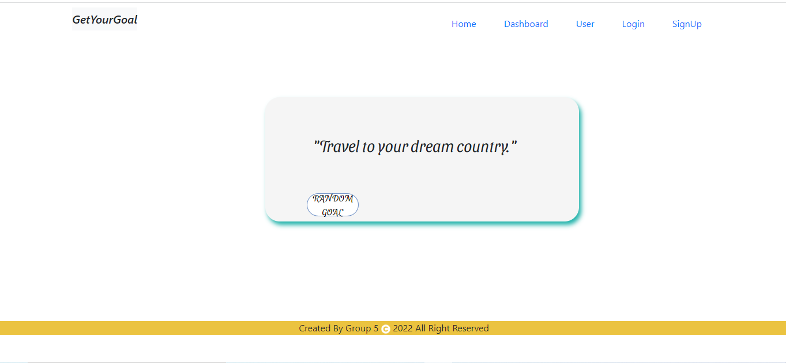
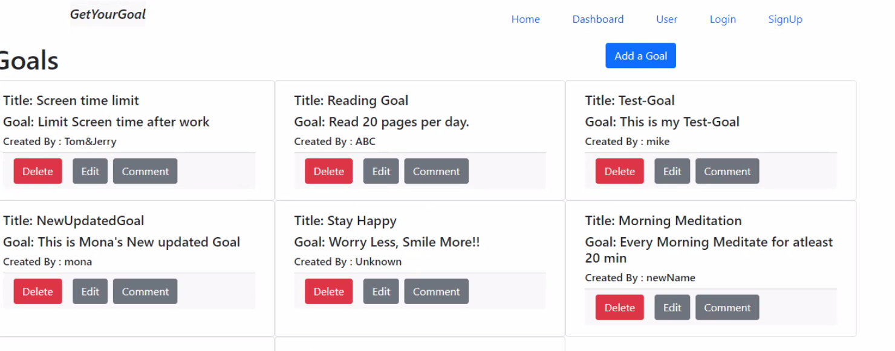

# get-your-goal-react-front

## Task

We build a Spring Boot Java back-end get-your-goal-back-end, where user can create their goals and comment on other users’ goals. Here we build this React app to populate data from back-end CRUD from front-end as well. We
completely build this App from scratch. In this app we used following 
React based technologies, React-router-dom, Axios, React-bootstrap, React-icons, Reactstrap and bootstrap, google fonts. 

## User Story

```md
AS A user I can create goal
I WANT to edit and delete goal when achieved
SO THAT I can have track on my goal
I can register from app
So that I can use it
```
## Description


 ```md
GIVEN a GetYourGoal App front-end that work with connect to Java back-end
WHEN I visit the site for the first time
THEN I am presented with a Random Goal
WHEN I click on Random Goal Button, it will randomly showing Goal
WHEN I click on Dashboard
THEN I am presented with user's goals
WHEN I click on Add goal button
THEN I am presented with form that allow me to add goal
WHEN I save that goal, it will show up in dashboard
WHEN I wanted to delete or edit the goal
THEN I can do that with given Delete and Edit button
WHEN user wants to register for app
WHEN I click on Signup tab
THEN I am presented with signup form
When I fill form and Submit
THEN my credentials are saved in DB and that will be populating in User 
THEN user can create, update, retrieve and delete user details
WHEN user wants to CRUD for goal
THEN user can CRUD operation with goal and comment as well
```

## Mock-Up

The following image demonstrates the application functionality:





## Table Of Contents

- [Installation](#installation)
- [Usage](#usage)
- [Test](#test)
- [License](#license)
- [Contribution](#contribution)
- [Contact](#contact)
- [Questions](#questions)

## Installation

The following necessary technologies must be installed to run the application.

Node, React, React-router-dom, React-bootstrap, Axios, Reactstrap, React-icons, Google-fonts

## Usage

Application can be Run in VS Code with npm start command in terminal.

## Test

N/A

## License

This project is licensed under :

[MIT](https://opensource.org/licenses/MIT)

For more information about the license, check the above link.

## Contribution

Bindu Vaghela, Dereje Ayele

## Contact

* GitHub : Bindu - [bindi-v](https://github.com/bindi-v)
          
* GitHub : Dereje - [dereatom](https://github.com/dereatom)

* Email : bindi.vaghela@gmail.com , derejeatomsa2@gmail.com

## Questions

If you have any questions, please reach out to our Github.

### Link

* [The URL of the Back end GitHub repository](https://github.com/bindi-v/tech-news-java-api)

* [The URL of the GetYourGoal Front End](https://github.com/bindi-v/get-your-goal-back-end)

#### Thank you for visiting my Github!
